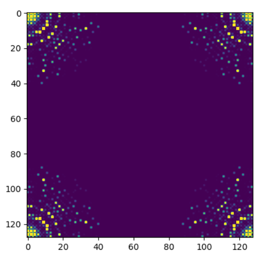
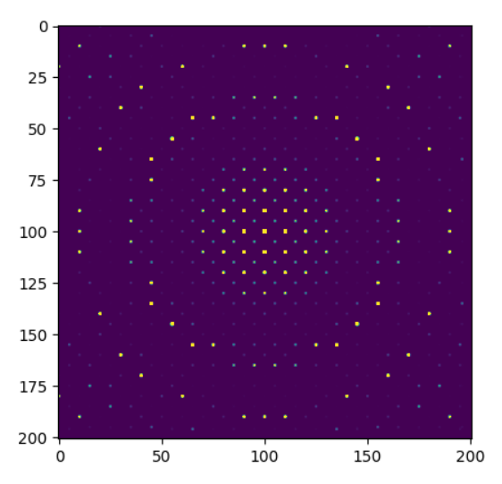

Simulation of Selected Area Diffraction (SAD) Pattern
================================================================

In this tutorial, we will simulate a selected area diffraction (SAD) pattern using the multislice method based on the crystal structure of gold (Au).

**1. Creating a Crystal Structure**

We first create a crystal structure of gold (Au) using lys_mat.CrystalStructure.
Download the CIF file for Au from [here (:download:`Au CIF file <data/Au.cif>`)] and save it in the *data* folder.
For details on how to create and manipulate crystal structures, please refer to the lys_mat `tutorial <https://a-tock.github.io/lys_mat/tutorial.html>`_ ::

    from lys_mat import CrystalStructure
    crys = CrystalStructure.loadFrom("data/Au.cif")
    print(crys)
    # Symmetry: cubic Fm-3m (No. 225), Point group: m-3m
    # a = 4.07825, b = 4.07825, c = 4.07825, alpha = 90.00000, beta = 90.00000, gamma = 90.00000
    # --- atoms (4) ---
    # 1: Au (Z = 79, Occupancy = 1) Pos = (0.00000, 0.00000, 0.00000)
    # 2: Au (Z = 79, Occupancy = 1) Pos = (0.00000, 0.50000, 0.50000)
    # 3: Au (Z = 79, Occupancy = 1) Pos = (0.50000, 0.00000, 0.50000)
    # 4: Au (Z = 79, Occupancy = 1) Pos = (0.50000, 0.50000, 0.00000)

**2. Defining the Computational Space**

Define the simulation space using the FunctionSpace class::

    from lys_em import FunctionSpace
    sp = FunctionSpace.fromCrystal(crys, 128, 128, 50)
    # The 2nd and 3rd arguments are the number of divisions per cell
    # The 4th is the number of slices along the thickness direction

**3. Creating the Crystal Potential**

Generate the potential field formed by the crystal using the CrystalPotential class::

    from lys_em import CrystalPotential
    pot = CrystalPotential(sp, crys)

**4. Defining the Electron Microscope Parameters**

Set up the electron microscope parameters using the TEM class::

    from lys_em import TEM
    tem = TEM(60e3)    # The first argument is the accelerating voltage (unit: V)

**5. Running the Multislice Simulation**

Using the parameters defined in steps 1–4, perform the multislice calculation.
This produces the selected area diffraction pattern, where each pixel corresponds to a reciprocal lattice point of the crystal::

    from lys_em import multislice, diffraction
    data = diffraction(multislice(pot, tem))

Visualize the diffraction pattern using matplotlib::

    import matplotlib.pyplot as plt
    plt.imshow(data, vmax=100000)
    plt.show()

**6. Optional: Rearranging the Data**

You can rearrange the diffraction data so that the [0, 0] spot is placed at the center,
and the pattern is displayed with evenly spaced data points along both x and y directions.
This produces an image appearance similar to that observed in real experiments::

    import numpy as np
    def rearrangeDiffraction(data, size, interval):
        res = np.zeros((size, size))
        for i in range(-size//(interval*2), size//(interval*2)):
            for j in range(-size//(interval*2), size//(interval*2)):
                res[i*interval, j*interval] = data[i, j]
        res = np.roll(res, (int(size/2), int(size/2)), axis=(0, 1))
        return res

    data = rearrangeDiffraction(data, 201, 5)
    plt.imshow(data, vmax=100000)
    plt.show()

**Summary**

Below is the complete code up to the execution of the multislice simulation::

    from lys_mat import CrystalStructure
    from lys_em import FunctionSpace, CrystalPotential, TEM, multislice, diffraction

    crys = CrystalStructure.loadFrom("data/Au.cif")
    sp = FunctionSpace.fromCrystal(crys, 128, 128, 50)
    pot = CrystalPotential(sp, crys)
    tem = TEM(60e3)
    data = diffraction(multislice(pot, tem))

    import matplotlib.pyplot as plt
    plt.imshow(data, vmax=100000)
    plt.show()