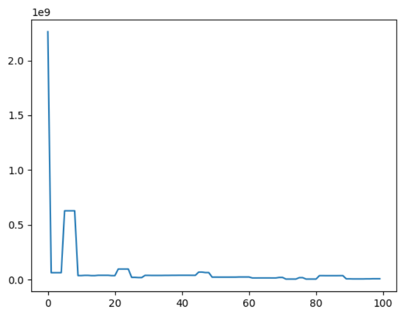

Crystal Structure Optimization Using PED Patterns
===================================================================================

In this tutorial, we optimize the crystal structure parameters of TiO₂ using its precession electron diffraction (PED) pattern.

**0. Preparation: Experimental Data for Optimization**

First, prepare the experimental data that will be used as the target for optimization.
In this tutorial, we simulate PED patterns using the CIF file of TiO₂,
and then perform optimization on the simulated data to confirm that the original CIF structure can be reproduced.

Download the following data files and save them in the *data* folder.
(:download:`TiO2_PED_data.npy <data/TiO2_PED_data.npy>`, :download:`TiO2_PED_indices.npy <data/TiO2_PED_indices.npy>`)

**1. Creating the Crystal Structure for Optimization**

Create a parametrized crystal structure from the CIF file.
For details, refer to the *lys_mat* `tutorial <https://a-tock.github.io/lys_mat/tutorial.html>`_.
Download the CIF file from [here (:download:`TiO2 CIF file <data/TiO2.cif>`)] and save it in the *data* folder::

    from lys_mat import CrystalStructure
    crys_raw = CrystalStructure.loadFrom("data/TiO2.cif")
    print(crys_raw)
    # Symmetry: tetragonal P4_2/mnm (No. 136), Point group: 4/mmm
    # a = 4.59400, b = 4.59400, c = 2.95860, alpha = 90.00000, beta = 90.00000, gamma = 90.00000
    # --- atoms (6) ---
    # 1: O (Z = 8, Occupancy = 1) Pos = (0.30495, 0.30495, 0.00000)
    # 2: O (Z = 8, Occupancy = 1) Pos = (0.69505, 0.69505, 0.00000)
    # 3: O (Z = 8, Occupancy = 1) Pos = (0.19505, 0.80495, 0.50000)
    # 4: O (Z = 8, Occupancy = 1) Pos = (0.80495, 0.19505, 0.50000)
    # 5: Ti (Z = 22, Occupancy = 1) Pos = (0.00000, 0.00000, 0.00000)
    # 6: Ti (Z = 22, Occupancy = 1) Pos = (0.50000, 0.50000, 0.50000)

    crys = crys_raw.createParametrizedCrystal()
    crys = crys.subs({key: value for key, value in crys.defaultParameters.items() if key != "y_O4"})
    print(crys)
    # Failed to find symmetry
    # a = 4.59400, b = 4.59400, c = 2.95860, alpha = 90.00000, beta = 90.00000, gamma = 90.00000
    # --- atoms (6) ---
    # 1: O (Z = 8, Occupancy = 1) Pos = (1/2 - y_O4, 1/2 - y_O4, 0.0)
    # 2: O (Z = 8, Occupancy = 1) Pos = (y_O4 + 1/2, y_O4 + 1/2, 0.0)
    # 3: O (Z = 8, Occupancy = 1) Pos = (y_O4, 1 - y_O4, 0.5)
    # 4: O (Z = 8, Occupancy = 1) Pos = (1 - y_O4, y_O4, 0.5)
    # 5: Ti (Z = 22, Occupancy = 1) Pos = (0.00000, 0.00000, 0.00000)
    # 6: Ti (Z = 22, Occupancy = 1) Pos = (0.50000, 0.50000, 0.50000)

In this tutorial, we optimize the parameter y_O4 and verify that it converges to approximately 0.195.

**2. Setting Parameters for PED Simulation**

Define the computational space, crystal potential, and TEM parameters for the PED simulation::

    import numpy as np
    from lys_em import FunctionSpace, CrystalPotential, TEM, TEMParameter
    spc = FunctionSpace.fromCrystal(crys, Nx=128, Ny=128, ncells=50)
    pot = CrystalPotential(spc, crys)
    tem = TEM(60e3, params=[TEMParameter(tilt=[2, phi]) for phi in np.arange(0, 360, 360 / 30)])

**3. Defining the Forward Calculation**

Define a function that performs the forward calculation for the precession diffraction::

    from lys_em import multislice, diffraction
    def calc_intensity(param):
        pot_subs = pot.replace(params=param)    # Create a new CrystalPotential using the given parameter values
        return diffraction(multislice(pot_subs, tem)).sum(axis=0)

**4. Loading the Experimental Data**

Load the experimental data prepared in step 0::

    data = np.load("data/TiO2_PED_data.npy")
    indices = np.load("data/TiO2_PED_indices.npy")

*data* contains the PED intensities and *indices* contains the indices of diffraction spots used for optimization::

    data.shape
    # (100,)
    indices.shape
    # (100, 3)
    print(indices[:10])
    # [[ 0  0  0]
    #  [ 0  1  0]
    #  [ 0 -1  0]
    #  [ 1  0  0]
    #  [-1  0  0]
    #  [ 1  1  0]
    #  [ 1 -1  0]
    #  [-1  1  0]
    #  [-1 -1  0]
    #  [ 0  2  0]]

Visualize the data with matplotlib::

    import matplotlib.pyplot as plt
    plt.plot(data)
    plt.show()

**5. Defining the Residual Function**

Define the residual function used for optimization::

    import jax.numpy as jnp
    def residual(values):
        calc = calc_intensity({name: value for name, value in zip(crys.free_symbols, values)})      # Forward calculation
        calc_arr = jnp.array([calc[int(indice[0]), int(indice[1])] for indice in indices])      # Extract calculated intensities
        scale = jnp.sum(data * calc_arr) / jnp.sum(calc_arr**2)     # Calculate scaling factor
        R = jnp.linalg.norm(data - scale * calc_arr, ord=1) / jnp.linalg.norm(data, ord=1)      # Calculate residual
        return jnp.array(R)

**6. Running the Optimization**

Suppress verbose output::

    import logging
    logging.getLogger().setLevel(logging.WARNING)

Set the initial value and parameter bounds, and perform optimization::

    import jax
    import scipy.optimize as optimize
    initial = [0.15]    # Initial guess
    bounds = [(0, 0.25)]    # Parameter bounds
    res = optimize.minimize(residual, initial, bounds=bounds, jac=jax.grad(residual), tol=7e-2)
    print("y_O4 :", res.x[0])
    # y_O4 : 0.19551157923009438

The result confirms that y_O4 ≈ 0.195, close to the value in the CIF file.

**Summary**

Complete code for performing the optimization::

    import numpy as np
    import jax
    import jax.numpy as jnp
    import scipy.optimize as optimize
    import logging
    from lys_mat import CrystalStructure
    from lys_em import FunctionSpace, CrystalPotential, TEM, TEMParameter, multislice, diffraction

    # Create crystal structure
    crys_raw = CrystalStructure.loadFrom("data/TiO2.cif")
    crys = crys_raw.createParametrizedCrystal()
    crys = crys.subs({key: value for key, value in crys.defaultParameters.items() if key != "y_O4"})

    # Set simulation parameters
    spc = FunctionSpace.fromCrystal(crys, Nx=128, Ny=128, ncells=50)
    pot = CrystalPotential(spc, crys)
    tem = TEM(60e3, params=[TEMParameter(tilt=[2, phi]) for phi in np.arange(0, 360, 360 / 30)])

    # Define forward calculation
    def calc_intensity(param):
        pot_subs = pot.replace(params=param)
        return diffraction(multislice(pot_subs, tem)).sum(axis=0)

    # Load experimental data
    data = np.load("data/TiO2_PED_data.npy")
    indices = np.load("data/TiO2_PED_indices.npy")

    # Define residual function
    def residual(values):
        calc = calc_intensity({name: value for name, value in zip(crys.free_symbols, values)})
        calc_arr = jnp.array([calc[int(indice[0]), int(indice[1])] for indice in indices])
        scale = jnp.sum(data * calc_arr) / jnp.sum(calc_arr**2)
        R = jnp.linalg.norm(data - scale * calc_arr, ord=1) / jnp.linalg.norm(data, ord=1)
        return jnp.array(R)

    # Run optimization
    logging.getLogger().setLevel(logging.WARNING)
    res = optimize.minimize(residual, [0.15], bounds=[(0, 0.25)], jac=jax.grad(residual), tol=7e-2)
    print("y_O4 :", res.x[0])
    # y_O4 : 0.19551157923009438